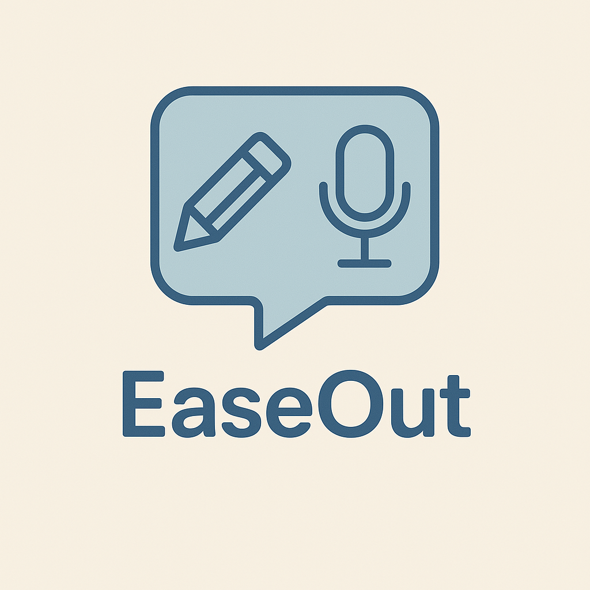

# EaseOut

    

## 🌐 [Accede a EaseOut](https://easeout-production.up.railway.app/)

# 🎧 EaseOut – Tu Diario Emocional Privado

**EaseOut** es una aplicación web minimalista y privada diseñada para ayudarte a liberar el estrés emocional mediante entradas de voz y texto. Ya sea que hayas tenido un mal día, estés lidiando con frustración o simplemente necesites desahogarte, **EaseOut** es tu espacio íntimo, lejos de redes sociales y juicios.

---

## ✨ Características

- 📝 **Escritura rápida y sencilla** – Expresa tus emociones en segundos.
- 🎙️ **Notas de voz** – Habla cuando escribir no sea suficiente.
- 🔒 **Privacidad total** – Tus pensamientos son solo tuyos.
- 🧘 **Diseño minimalista y relajante** – Enfocado en tu bienestar mental.
- 🗂️ **Entradas organizadas por fecha** – Reflexiona cuando lo necesites.
- 🌗 **Modo oscuro** – Cambia entre modo claro y oscuro para una mejor experiencia visual.
- ☁️ **Almacenamiento seguro en la nube** – Tus audios se guardan en **AWS S3**.
- 🎨 **Iconografía intuitiva** – Mejora visual y de accesibilidad con iconos contextuales.
- ⚡ **Notificaciones elegantes** – Mensajes de éxito y error visuales con **SweetAlert2**.
- 🚦 **Feedback visual inmediato** – Barra de progreso global con **NProgress** para operaciones importantes.
- 💫 **Animaciones suaves** – Transiciones y modales animados con **framer-motion**.
- 😍 **Más estados de ánimo** – Ahora puedes elegir entre más de 10 moods diferentes, incluyendo amor, desamor, gratitud, motivación y más.
- ♿ **Accesibilidad mejorada** – Navegación por teclado y etiquetas ARIA en los botones principales.

---

## 🛠️ Tecnologías Utilizadas

- [Laravel](https://laravel.com/) – Framework para el backend
- [React](https://reactjs.org/) – Librería para la interfaz de usuario
- [Tailwind CSS](https://tailwindcss.com/) – Framework CSS de utilidades
- [Laravel Breeze](https://laravel.com/docs/starter-kits#breeze) – Autenticación y scaffolding
- [AWS S3](https://aws.amazon.com/s3/) – Almacenamiento en la nube para archivos de audio

---

## 📦 Librerías y Herramientas Adicionales

- [Axios](https://axios-http.com/) – Peticiones HTTP desde React
- [React Router](https://reactrouter.com/) – Navegación entre rutas
- [React Hook Form](https://react-hook-form.com/) – Manejo eficiente de formularios
- [UUID](https://www.npmjs.com/package/uuid) – Generación de identificadores únicos
- [Howler.js](https://howlerjs.com/) – Reproducción y control de audios
- [SweetAlert2](https://sweetalert2.github.io/) – Alertas y notificaciones visuales
- [NProgress](https://www.npmjs.com/package/nprogress) – Barra de progreso global para feedback inmediato
- [framer-motion](https://www.framer.com/motion/) – Animaciones suaves y transiciones
- [react-spinners](https://www.npmjs.com/package/react-spinners) – Indicadores de carga locales
- [Lucide Icons](https://lucide.dev/) o [Font Awesome](https://fontawesome.com/) – Iconos claros y accesibles
- [Dark Mode with Tailwind](https://tailwindcss.com/docs/dark-mode) – Estilo adaptable según preferencia del usuario

---

## 🚧 Estado del Proyecto

Este proyecto está en desarrollo activo como una iniciativa personal de **Enrique Cuevas García**.  
Se agradece cualquier sugerencia, idea o mejora que quieras aportar 🤝

---

## 📄 Licencia

Este proyecto se distribuye bajo la licencia [MIT](LICENSE).
